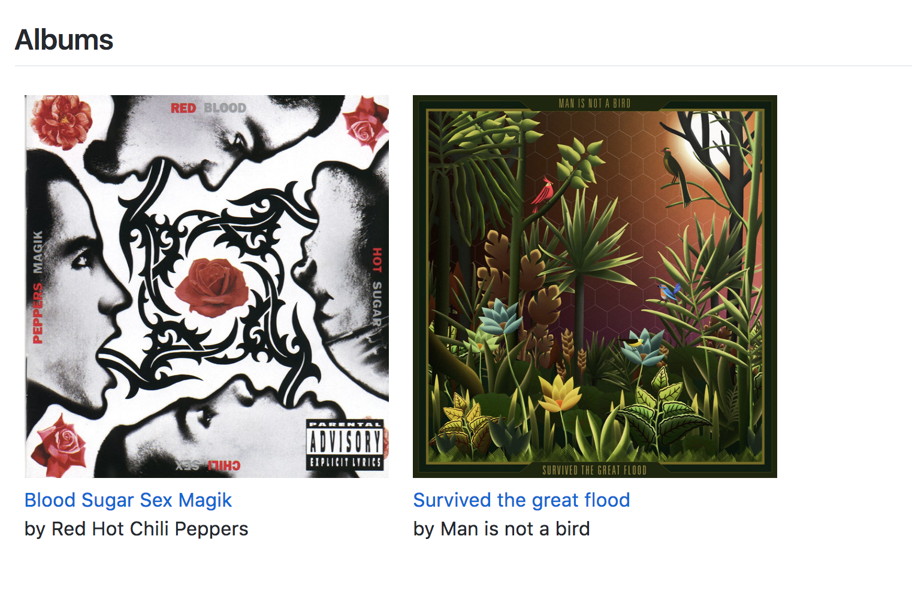

# jekyll-tutorial

Screenshot:

Tutorial:

- Part 1: [How to maintain a collection of music albums online, using Jekyll and Github Pages](https://dev.to/adrienjoly/how-to-maintain-a-collection-of-music-albums-online-using-jekyll-and-github-pages-3hd6)
- Part 2: [[Make your static site searchable with Jekyll-Algolia](https://dev.to/adrienjoly/make-your-static-site-searchable-with-jekyll-algolia-edh)
